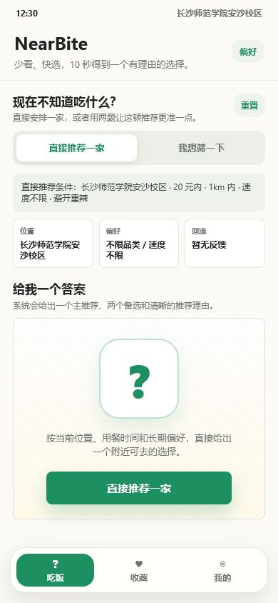
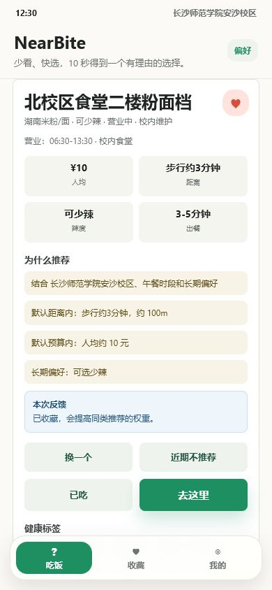
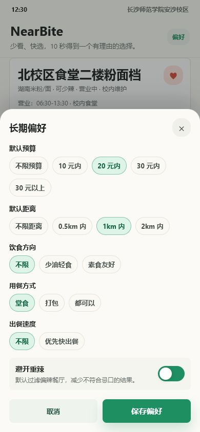
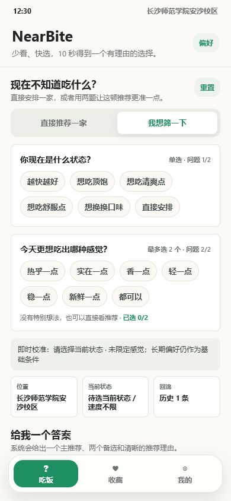
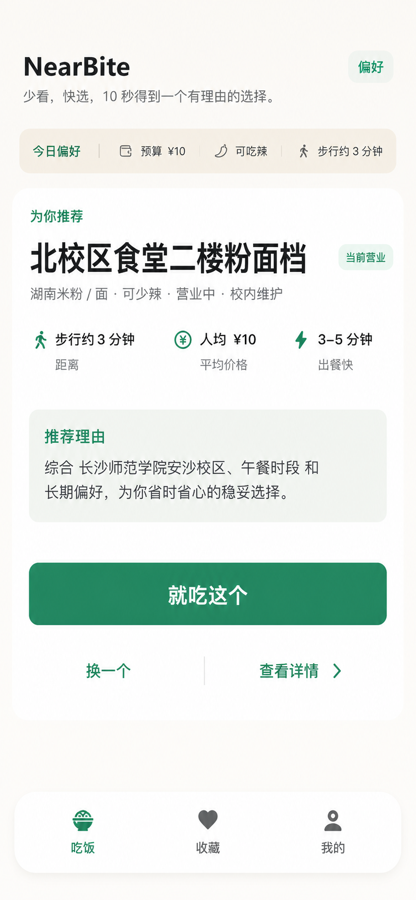
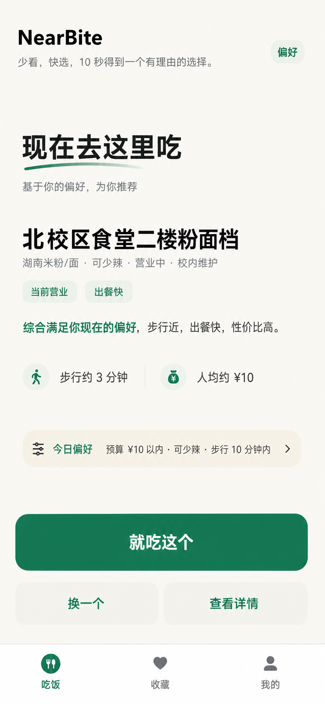
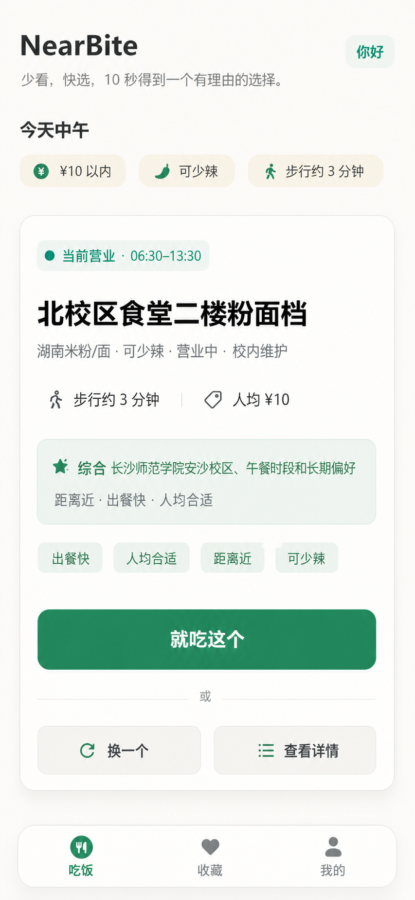

# NearBite 产品定位与流程合理性审查

审查日期：2026-07-01

## 1. 审查范围

- 产品：NearBite 3.0 iOS 原型
- 核心任务：用户不知道吃什么时，在 10 秒内完成一次附近用餐决策
- 审查重点：产品定位、首页入口、随机/翻牌机制、推荐结果、长期偏好、两题参与模式
- 证据：本目录中 4 张当前流程截图，以及用户指出定位偏差的 3 张候选方案

## 2. 产品定位基线

项目已有文档给出的定位是：

> 解决“今天吃什么”选择困难的快速决策工具。

差异化不是普通的个性化餐厅推荐，而是：

> 智能筛选保证候选结果基本靠谱，再通过随机推荐与翻牌互动帮助用户停止纠结。

这意味着 NearBite 的职责不是证明某家餐厅是“最优解”，而是在预算、距离、口味、营业状态等边界内，替用户快速做一个足够好的决定。

合理的产品结构应当是：

```text
智能筛选候选池 → 随机给出一个答案 → 简短说明为什么不踩雷 → 用户去吃或再抽一次
```

## 3. 总体结论

三个候选视觉方案都不建议直接实施。

它们解决了信息层级问题，却把 NearBite 变成了“算法替你挑选最优餐厅”的推荐助手，弱化了产品原本的随机性、翻牌仪式感和参与式选择。这会让产品越来越接近普通餐饮推荐工具，与美团、大众点评的差异缩小。

当前 3.0 流程保留了正确的产品基因，但入口、结果和偏好都承载了太多说明与操作，10 秒决策承诺没有真正落实。

## 4. 流程步骤与健康度

### Step 1：首页进入决策



健康度：需要重构。

优点：

- 明确保留“直接推荐一家”和“我想筛一下”两条路径。
- 翻牌问号能够传达随机揭晓和趣味性。
- 位置、预算和距离说明了推荐不是完全盲抽。

问题：

- 一个页面同时出现模式切换、条件摘要、三个上下文块、解释文本和大翻牌区，用户在抽取前需要先理解产品。
- “直接推荐一家”出现两次，主入口不唯一。
- “给我一个答案”区域仍先解释系统会做什么，没有直接推动动作。
- “两个备选”提前承诺会把用户重新带回选择状态，与停止纠结的定位冲突。

建议：

- 首页只保留一个主动作“替我抽一个”。
- “想更准一点”作为次级入口进入两题模式。
- 当前条件压缩成一行，例如“20 元内 · 1km · 避开重辣”，允许轻触修改。
- 保留翻牌视觉，但不要先给出餐厅结果；用户点击后再揭晓，这是产品记忆点。

### Step 2：随机结果与行动



健康度：功能完整，但决策负担过高。

优点：

- 店名、价格、距离、辣度、出餐速度能够验证结果是否可接受。
- 推荐理由说明了位置、预算和长期偏好确实参与筛选。
- “去这里”能把决策推进到行动。

问题：

- 结果同时提供收藏、换一个、近期不推荐、已吃、去这里、健康标签、两个备选和详情入口，用户重新进入功能选择。
- 四条推荐理由逐项解释算法，信息密度超过快速决策场景需要。
- “已收藏”反馈在结果出现时抢占注意力，且与本次是否去吃不是同一决策层级。
- 同时展示两个备选会把随机给答案退化成餐厅列表。

建议：

- 结果只保留一个主动作“去这里”。
- 次级动作只保留“再抽一次”和“不想吃”。
- 推荐理由收敛成一句：“步行 3 分钟、10 元左右、可少辣，符合你今天想快点吃的状态。”
- 收藏、详情、已吃放在结果的后续层级，不与主决策并列。
- 备选不同时展示；“再抽一次”时再替换当前结果。

### Step 3：长期偏好



健康度：结构清楚，但与即时场景混在一起。

优点：

- 预算、距离、忌口等条件适合作为推荐候选池的安全边界。
- 选项形式比表单轻，状态清楚。

问题：

- “饮食方向、用餐方式、出餐速度”不一定是长期稳定偏好，更像今天这一顿的状态。
- 选项较多，用户会把它理解为配置系统，而不是快速开始。
- 首页右上角“偏好”入口过强，容易把用户引离主流程。

建议：

- 长期偏好只保留稳定边界：预算上限、最远距离、忌口。
- “赶时间、堂食/打包、想吃清爽/顶饱”进入今日状态或两题模式。
- 长期偏好放入“我的”，首页只显示压缩摘要。

### Step 4：两题参与模式



健康度：符合差异化方向，但步骤展示方式过重。

优点：

- 保留用户参与感，符合“选择随机”而不是纯算法推荐。
- 问题围绕当下状态和感觉，方向正确。
- 最终仍汇入同一个随机翻牌结果，主流程一致。

问题：

- 两道题同时展开，选项数量较多，页面看起来像筛选器。
- “直接安排”“都可以”和底部“看推荐”形成多个跳过/确认入口。
- 用户还没有回答时就展示大量校准说明和状态块，增加理解成本。

建议：

- 一次只展示一道题，选择后自然进入下一题。
- 每题控制在 4 个答案以内。
- 第二题提供一个明确的“都可以”，之后直接进入翻牌。
- 不展示算法校准说明；只在结果里用一句话说明答案如何影响推荐。

## 5. 三个候选方案为何偏离定位

### 候选 1：结果优先



- 优点是层级清楚、主动作明确。
- 但打开首页就直接看到餐厅，消失了“抽取—翻牌—揭晓”的产品记忆点。
- “为你推荐”强化了算法最佳推荐心智，不是随机决策心智。

### 候选 2：极简决策



- 视觉最简洁，行动路径短。
- 但最像普通个性化餐厅推荐助手，随机性和互动性几乎完全消失。
- “现在去这里吃”表达过度确定，系统又没有足够真实数据支撑这种权威感。

### 候选 3：场景优先



- 保留较完整的决策依据，是三个方案里最接近现有产品的一版。
- 但仍然先展示结果，翻牌只剩“换一个”的动画效果，不再是核心决策机制。
- 标签和原因仍偏多，结果页像餐厅信息卡。

## 6. 建议的新主流程

### 直接决策路径

```text
打开 App
→ 看到当前位置、餐段和一行默认条件
→ 点击“替我抽一个”
→ 翻牌揭晓一个符合条件的结果
→ 查看一句可信理由
→ 点击“去这里”
```

### 不满意路径

```text
结果页
→ 点击“再抽一次”
→ 当前结果翻牌替换
→ 不展示并列备选列表
```

### 想参与路径

```text
首页
→ 点击“想更准一点”
→ 回答当前状态
→ 回答想吃的感觉
→ 翻牌揭晓结果
→ 点击“去这里”
```

### 反馈闭环

```text
导航后或下次打开
→ 轻量询问“上次吃了吗？”
→ 已吃 / 没去
→ 结果进入历史并调整后续权重
```

## 7. 推荐的信息层级

首页：

1. 当前位置与餐段
2. “替我抽一个”主动作
3. 当前默认条件摘要
4. “想更准一点”次级入口

结果：

1. 店名与品类
2. 距离、价格、营业状态
3. 一句推荐理由
4. “去这里”主动作
5. “再抽一次 / 不想吃”次级动作

其余收藏、详情、历史和长期偏好均退出主决策层。

## 8. 可访问性风险与验证边界

- 当前多处说明文字约 11–12px，移动端阅读压力较大。
- 部分浅灰文字和浅绿色背景的对比度可能不足，需要用实际颜色值计算验证。
- 多个胶囊选项高度约 34px，可能低于舒适触控目标。
- 翻牌动画应尊重 `prefers-reduced-motion`，并在状态变化后向辅助技术说明新结果。
- 截图可以确认层级和可见性风险，但不能证明键盘顺序、读屏播报和动态焦点管理完整。

## 9. 最终设计原则

```text
筛选负责不踩雷，随机负责结束纠结。
翻牌负责制造参与感，结果负责推动去吃。
首页不展示餐厅列表，也不假装给出绝对最优解。
```
