# 今天吃什么 2.0 最新交互流程与竞品详细分析

更新时间：2026-07-01

适用版本：`D:\Projects\移动大赛\eatwhat2\2.0-参赛包\iOS原型`

---

## 1. 本文目标

这份文档解决三个问题：

1. 当前最新 2.0 原型到底已经做到哪一步。
2. 从打开 App 到注册、引导、推荐、收藏、回流的完整交互链路是什么。
3. 竞品分别长什么样、用户一般怎么用、它们和“今天吃什么 2.0”的核心差异是什么。

---

## 2. 当前版本结论

和旧版相比，当前 2.0 原型已经不只是“推荐页原型”，而是补齐了更完整的首登体验，至少已经覆盖：

- 欢迎页
- 注册方式选择
- 手机号注册
- Apple ID 快捷注册分支
- 验证码页
- 注册成功页
- 资料完善页
- 兴趣偏好页
- 新手引导页
- 首页推荐
- 收藏
- 我的
- 位置选择
- 长期偏好
- 历史记录
- 餐饮数据维护

也就是说，当前版本已经具备“比赛展示型完整用户路径”的雏形。

---

## 3. 当前版本页面清单

### 3.1 首次使用链路

- 欢迎页
- 注册方式页
- 手机号输入页
- 验证码页
- 注册成功页
- 资料完善页
- 兴趣偏好页
- 新手引导页

### 3.2 进入首页后的主链路

- 吃饭页
- 收藏页
- 我的页

### 3.3 弹层和辅助页面

- 长期偏好弹层
- 推荐详情弹层
- 步行路线弹层
- 位置选择弹层
- 餐饮数据管理弹层

---

## 4. 从点击 App 到进入首页的真实流程

### 4.1 主流程判断

当前最新版本里，首次打开 App 默认先进入注册与引导流，而不是直接落到首页。

如果本地已经存在完成标记，则会跳过引导，直接进入首页。

这意味着它已经具备基础的“首登”和“二次回访”区分逻辑。

### 4.2 首登主链路

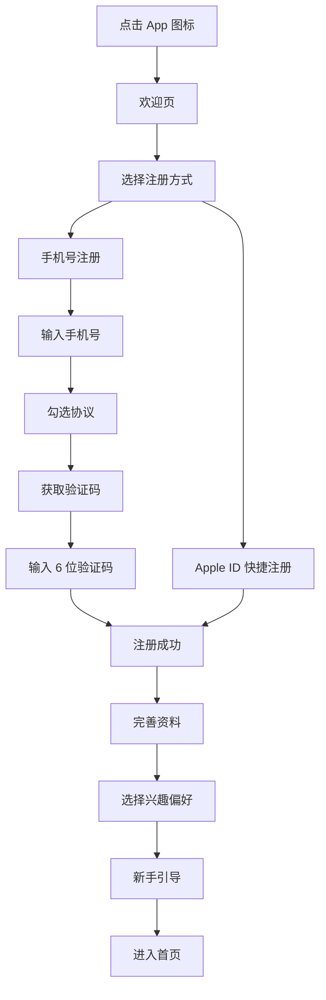

### 4.3 手机号注册细节

手机号链路已具备这些细节：

- 中国大陆手机号格式校验
- 协议勾选后按钮才可点击
- 验证码页
- 重发倒计时
- 验证失败提示

当前原型中的验证码是演示值：

- `246810`

这说明它不是空壳页面，而是已经有一套完整的交互反馈逻辑。

### 4.4 Apple ID 分支的真实定位

Apple ID 分支目前是快捷演示分支，不调用真实 Apple 服务。

它的意义是：

- 满足 iOS 方向的产品表达
- 缩短比赛演示时间
- 避免真实第三方登录集成成本

如果用于比赛展示，这是合理的；如果未来要变成真实产品，必须替换成正式的 Sign in with Apple。

### 4.5 资料完善页细节

资料完善页支持：

- 头像上传
- 昵称
- 密码
- 性别
- 生日

其中当前逻辑更偏“比赛演示合理性”而非真实账号系统：

- 密码只做长度校验
- 原型不保存明文
- 昵称是主要身份展示

### 4.6 兴趣偏好页细节

当前可选兴趣有：

- 出餐快
- 少走路
- 20 元内
- 少油轻食
- 喜欢吃辣
- 粉面

这些偏好会进一步影响默认推荐条件，属于“账号体系和推荐系统的桥接层”。

这是当前版本比较聪明的一点：注册不是单纯为了“有账号”，而是为了让推荐更个性化。

### 4.7 新手引导页定位

引导页强调三件事：

1. 先看长期偏好
2. 点击“帮我决定”
3. 通过反馈让系统更懂你

这说明产品叙事已经不再是“随机抽一个”，而是“低决策成本、越来越懂你”的个性化决策助手。

---

## 5. 进入首页后的主交互流程

### 5.1 首页推荐主流程

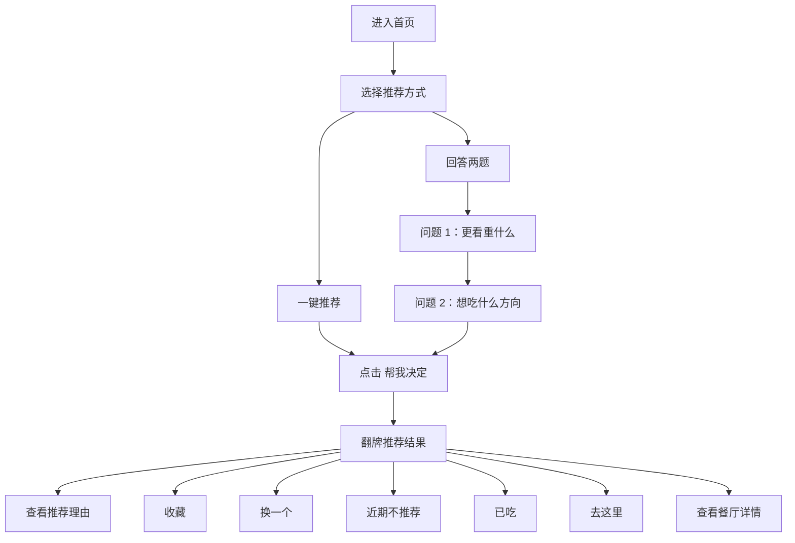

### 5.2 当前版本首页的两个模式

#### 一键推荐

适用场景：

- 赶时间
- 懒得想
- 相信系统

系统依据：

- 当前位置
- 当前时间
- 长期偏好
- 历史行为

#### 回答两题

适用场景：

- 今天状态特殊
- 想稍微参与一下
- 不希望系统完全自动判断

题目设计也比旧版更收敛，只保留两题，明显是在压缩决策成本。

### 5.3 结果页设计重点

结果页不是只给店名，而是给“可解释的理由”。

当前展示字段包括：

- 人均
- 距离
- 辣度
- 出餐速度
- 健康标签
- 推荐理由
- 两个备选

这是产品可信度的关键。

因为真正的“吃什么”场景里，用户不怕只有一个答案，怕的是“这个答案看起来不靠谱”。

### 5.4 结果页后的四类反馈行为

当前版本把用户反馈拆成四类：

- 收藏
- 换一个
- 近期不推荐
- 已吃

这比旧版更成熟，因为它把用户反馈从“喜欢/不喜欢”扩展成更接近真实生活语义的行为。

其中：

- `收藏` 代表长期偏好
- `近期不推荐` 代表短期避让
- `已吃` 代表近期消费记录
- `换一个` 代表即时否定

这四种反馈很适合以后继续喂给推荐算法。

---

## 6. 我的、位置、数据管理的意义

### 6.1 “我的”页已不只是信息展示

当前“我的”页承担了三个职责：

- 账号摘要
- 偏好和位置入口
- 再次进入新手流程的入口

这说明产品已经从单页原型过渡到“有生命周期的 App 原型”。

### 6.2 位置选择页的价值

位置页支持：

- 系统定位
- 手动区域选择

当前手动预设包括：

- 安沙校区中心
- 北校区食堂
- 学生宿舍区

这一步很重要，因为它解决了 1.0 最大痛点之一：

- 定位失败或未授权，不再阻断推荐

### 6.3 餐饮数据管理页的意义

当前版本甚至加入了“餐饮数据维护”入口，这说明队友已经开始考虑：

- 冷启动数据如何更新
- 过期店铺如何停用
- 样本数据如何扩展

这对比赛答辩很有帮助，因为老师可能会问：

- 你们的数据从哪来
- 如果学校周边商家变化了怎么办

现在这个原型已经有比较合理的回答方向。

---

## 7. 当前版本的交互优势与不足

### 7.1 优势

- 首登链路完整，比赛展示更像一个真实 App
- 登录不再是孤立步骤，而是和偏好初始化挂钩
- 两题模式比旧版五题更轻量
- 推荐理由比单纯随机更可信
- 位置失败时有降级方案
- 用户反馈维度更细
- 已经考虑数据维护和历史回流

### 7.2 不足

- 仍然是原型，不是真实账号系统
- Apple ID 只是演示分支
- 验证码不是真实短信
- 数据管理能力是本地原型级别
- 没有真正的云同步
- 没有真实交易闭环
- 没有多人共决策

---

## 8. 竞品分析方法

本项目不应该只和一个产品比，而应该从三类竞品看：

1. 交易平台型
2. 信息决策型
3. 健康饮食型

这样才能说明“今天吃什么 2.0”到底切的是哪一段链路。

---

## 9. 竞品一：美团外卖

参考链接：

- 官网：<https://www.meituan.com/>
- App Store：<https://apps.apple.com/cn/app/%E7%BE%8E%E5%9B%A2%E5%A4%96%E5%8D%96-%E5%A4%96%E5%8D%96%E8%AE%A2%E9%A4%90-%E9%80%81%E5%95%A5%E9%83%BD%E5%BF%AB/id737310995>

### 9.1 它是什么样的

美团外卖的典型首页特征通常是：

- 搜索框
- 分类入口
- 优惠活动
- 商家列表
- 配送信息
- 排序筛选

它默认假设用户的目标是：

- 我准备点外卖
- 我想找一个商家
- 我愿意看一串列表来比较

### 9.2 典型用户流程

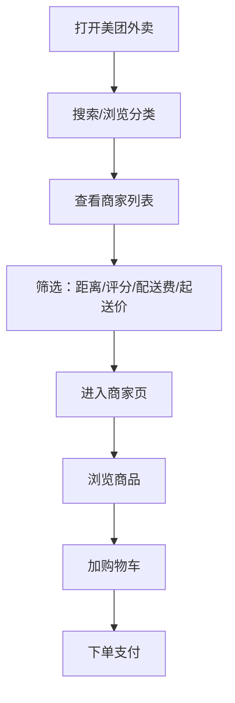

### 9.3 它的强点

- 商家覆盖广
- 履约成熟
- 优惠多
- 配送状态明确
- 用户认知强

### 9.4 它的弱点

- 进入成本高
- 列表很长
- 决策焦虑强
- 用户越犹豫越容易继续刷

### 9.5 对本项目的借鉴

- 可借鉴结构化信息展示
- 可借鉴“是否营业”“距离”“价格”这类即时判断字段
- 可借鉴行动按钮的明确性

### 9.6 不应照搬的地方

- 不应照搬海量列表
- 不应把首页做成“越多越全”
- 不应把重点放到优惠券和交易链路

### 9.7 和本项目的根本差异

美团解决的是：

- “我已经准备点餐了”

今天吃什么 2.0 解决的是：

- “我还没决定到底吃什么”

---

## 10. 竞品二：淘宝闪购 / 饿了么

参考链接：

- 饿了么官网：<https://www.ele.me/>
- App Store：<https://apps.apple.com/cn/app/%E6%B7%98%E5%AE%9D%E9%97%AA%E8%B4%AD-%E7%82%B9%E5%A4%96%E5%8D%96%E6%9B%B4%E4%BC%98%E6%83%A0/id507161324>

### 10.1 它是什么样的

淘宝闪购 / 饿了么本质也是交易导向产品。

它更强调：

- 即时送达
- 外卖
- 价格和补贴
- 附近商家
- 下单效率

### 10.2 典型用户流程

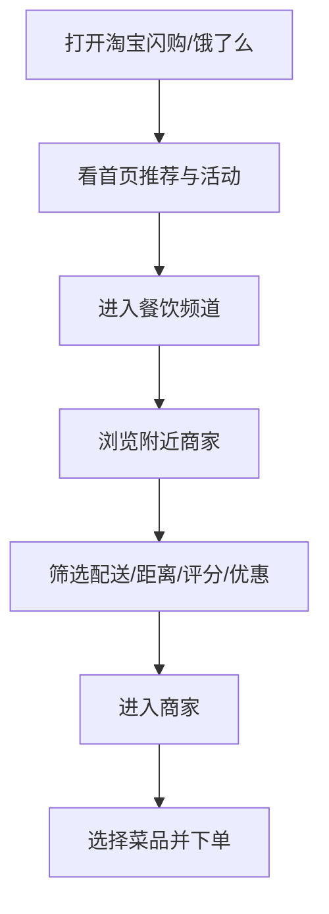

### 10.3 它的强点

- 即时性强
- 交易链路短
- 活动感强
- 用户对“马上能买到”的感知明确

### 10.4 它的弱点

- 对“没想好吃什么”的人仍然不够友好
- 决策压力仍在用户自己身上

### 10.5 对本项目的借鉴

- 可借鉴“可执行反馈”
- 可借鉴“离我多远、多久能拿到”的直观感
- 可借鉴“当前状态很明确”的产品表达

### 10.6 核心差异

闪购/饿了么是：

- 快速完成消费

今天吃什么 2.0 是：

- 快速完成决策

---

## 11. 竞品三：大众点评

参考链接：

- 官网：<https://www.dianping.com/>
- App Store：<https://apps.apple.com/cn/app/%E5%A4%A7%E4%BC%97%E7%82%B9%E8%AF%84-%E5%90%83%E5%96%9D%E7%8E%A9%E4%B9%90%E6%8C%87%E5%8D%97/id351091731>

### 11.1 它是什么样的

大众点评更接近“我想认真选一家店”的场景。

它的典型信息密度很高：

- 评分
- 人均
- 榜单
- 评价
- 图片
- 套餐
- 到店信息

### 11.2 典型用户流程

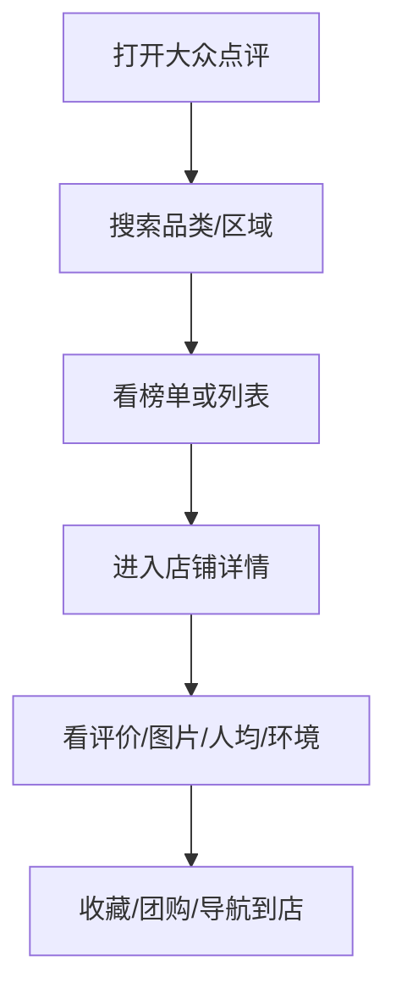

### 11.3 它的强点

- 可信度强
- 比较信息多
- 适合到店决策
- 榜单和评价体系成熟

### 11.4 它的弱点

- 决策时间长
- 需要持续比较
- 用户很容易越看越纠结

### 11.5 对本项目的借鉴

- “为什么推荐”一定要清楚
- 标签系统要稳定
- 详情页要帮助用户快速确认，而不是重新开始纠结

### 11.6 核心差异

大众点评让用户：

- 比较多家店，自己做判断

今天吃什么 2.0 让用户：

- 先接受一个有理由的主推荐

---

## 12. 竞品四：小红书

参考链接：

- 官网：<https://www.xiaohongshu.com/>
- Google Play：<https://play.google.com/store/apps/details?id=com.xingin.xhs>

### 12.1 它是什么样的

小红书是内容种草平台，不是决策工具。

它更像：

- 看别人吃什么
- 看什么店值得去
- 看生活方式内容

### 12.2 典型用户流程

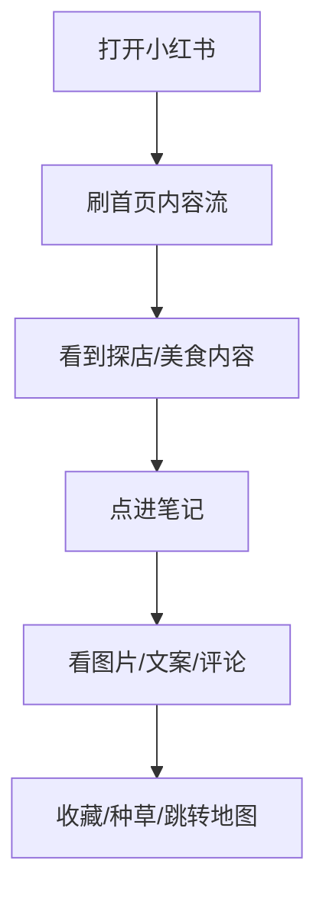

### 12.3 它的强点

- 氛围感强
- 种草能力强
- 场景化表达强
- 发现新店效率高

### 12.4 它的弱点

- 不是短链路决策工具
- 容易陷入“看内容”
- 并不擅长 10 秒内给你一个答案

### 12.5 对本项目的借鉴

- 推荐理由文案可以更有场景感
- 视觉上可以更生活化
- 未来可以做“今日状态推荐文案”

### 12.6 核心差异

小红书更像：

- 发现欲望

今天吃什么 2.0 更像：

- 结束犹豫

---

## 13. 竞品五：薄荷健康

参考链接：

- 官网：<https://www.boohee.com/>
- App Store：<https://apps.apple.com/cn/app/%E8%96%84%E8%8D%B7%E5%81%A5%E5%BA%B7-ai%E5%87%8F%E8%82%A5%E5%81%A5%E8%BA%AB%E8%BD%BB%E6%96%AD%E9%A3%9F%E4%BD%93%E9%87%8D%E7%AE%A1%E7%90%86%E5%B9%B3%E5%8F%B0/id457856023>

### 13.1 它是什么样的

薄荷健康是健康管理工具，不是附近餐饮决策工具。

它强调：

- 热量
- 营养
- 减脂
- 饮食记录
- 体重目标

### 13.2 典型用户流程

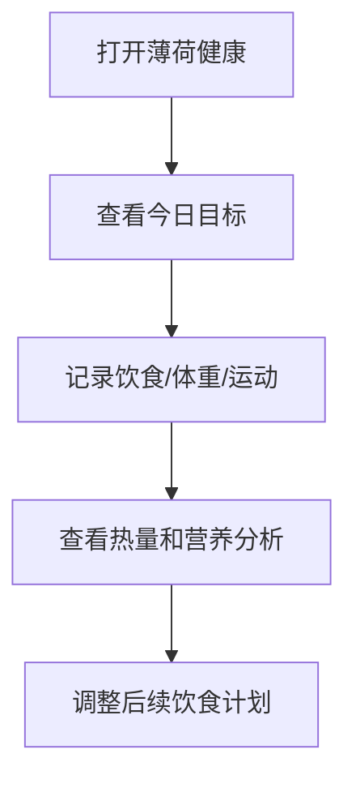

### 13.3 它的强点

- 健康维度很强
- 数据结构成熟
- 用户目标感明确

### 13.4 它的弱点

- 不解决“附近吃什么”的即时场景
- 更像长期管理工具

### 13.5 对本项目的借鉴

- 健康标签是很好的差异点
- 可继续强化“少油轻食”“高蛋白”“晚餐低负担”
- 长期可扩展减脂友好场景

---

## 14. 竞品六：下厨房

参考链接：

- 官网：<https://www.xiachufang.com/>
- App Store：<https://apps.apple.com/cn/app/%E4%B8%8B%E5%8E%A8%E6%88%BF-%E7%BE%8E%E9%A3%9F%E8%8F%9C%E8%B0%B1/id460979760>

### 14.1 它是什么样的

下厨房解决的是：

- 自己做什么吃

它的核心对象是：

- 做饭的人
- 找菜谱的人
- 学烹饪的人

### 14.2 典型用户流程

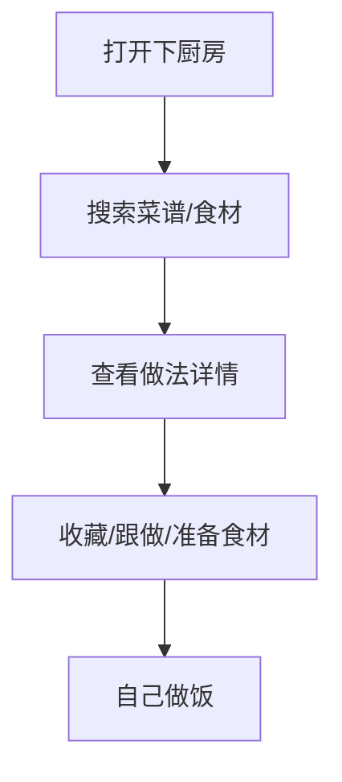

### 14.3 对本项目的意义

它不是直接竞品，但能提醒你们：

- “吃什么”这个大问题里还有“自己做”的分支
- 当前 2.0 先不要做太宽
- 最好仍聚焦“校园/园区外出就餐决策”

---

## 15. 竞品分层结论

### 15.1 竞争格局图

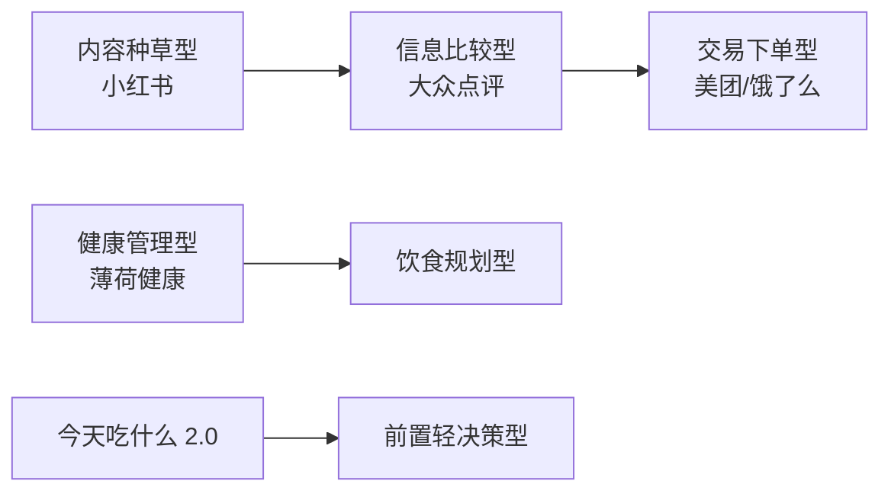

### 15.2 你们真正卡位的位置

今天吃什么 2.0 不属于：

- 交易平台
- 评价平台
- 内容社区
- 热量管理工具

它属于：

- 前置轻决策工具

它的任务不是让用户“看更多”，而是让用户“更快停下来看够了”。

---

## 16. 竞品对比总表

| 产品 | 用户当下问题 | 首页结构 | 决策方式 | 最终动作 | 决策时长 | 对本项目启发 |
| --- | --- | --- | --- | --- | --- | --- |
| 美团外卖 | 我准备点餐 | 搜索 + 分类 + 商家列表 | 列表筛选 | 下单支付 | 中 | 信息结构、营业状态、明确行动按钮 |
| 淘宝闪购/饿了么 | 我想尽快买到 | 活动 + 附近商家 + 配送信息 | 列表筛选 | 下单支付 | 中 | 即时反馈、距离和时间感 |
| 大众点评 | 我想比较几家店 | 搜索 + 榜单 + 评价 | 比较判断 | 收藏/到店/团购 | 长 | 可信理由、详情页标签体系 |
| 小红书 | 我想发现好吃的 | 内容流 | 内容种草 | 收藏/跳转 | 长 | 场景文案、生活方式表达 |
| 薄荷健康 | 我要吃得更健康 | 目标 + 记录 | 目标驱动 | 记录和调整 | 中 | 健康标签、控卡与营养逻辑 |
| 下厨房 | 我想自己做饭 | 菜谱与食材 | 菜谱选择 | 跟做 | 中 | 扩展边界提醒，不宜当前照搬 |
| 今天吃什么 2.0 | 我没决定吃什么 | 引导 + 轻决策首页 | 系统给主推荐 | 去这里/收藏/反馈 | 短 | 核心是“快、少、准、可解释” |

---

## 17. 给比赛答辩时的说法

可以直接用下面这段：

“我们不是再做一个外卖平台，也不是再做一个点评社区。美团、饿了么解决的是交易效率，大众点评解决的是比较判断，小红书解决的是内容种草。今天吃什么 2.0 切入的是更前面的那一步：当用户还没决定吃什么时，用预算、距离、出餐速度、口味和健康偏好，把海量选择压缩成一个可信、可执行、可解释的答案。”

---

## 18. 下一步最值得推进的方向

### 18.1 如果目标是比赛演示更完整

优先级建议：

1. 首页和注册流跑通
2. 位置授权与手动降级都可演示
3. 收藏、已吃、近期不推荐形成闭环
4. 截取欢迎、注册、结果、收藏、我的五类页面

### 18.2 如果目标是更像真实产品

优先级建议：

1. 真实 Sign in with Apple
2. 真正的短信或验证码服务
3. 云端账号与收藏同步
4. 更丰富的数据维护后台
5. 个性化推荐权重

---

## 19. 一句话总结

2.0 最新版本已经从“翻牌推荐原型”进化成了“带首登引导、账号雏形、位置降级和反馈回流的轻决策 App 原型”；它最适合对标的不是单一竞品，而是一组产品链路中的空白位置：在交易、评价、内容种草和健康管理之间，专门解决“我现在到底吃什么”的前置决策问题。

---

## 20. 补充交互流程

这一部分补的是更接近真实产品评审时会被问到的流程：

- 首次打开和再次打开怎么分流
- Apple ID 和手机号注册怎么分支
- 定位失败后怎么继续
- 推荐结果被用户否定后怎么回流
- 管理员如何维护餐饮数据

### 20.1 启动分流流程

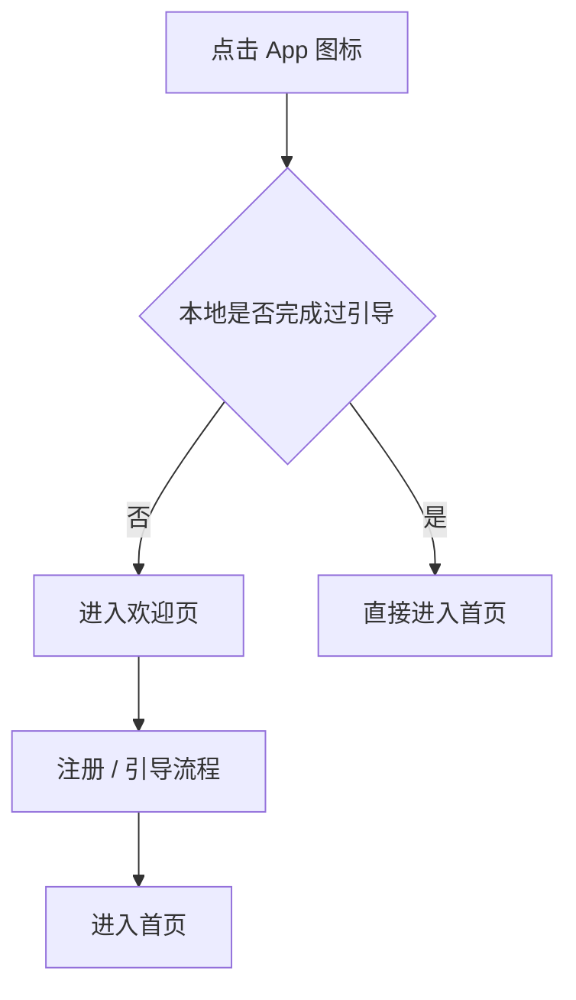

这条流程的意义：

- 首次使用强调产品价值和偏好初始化
- 回访用户不被重复打断

### 20.2 注册方式分支流程

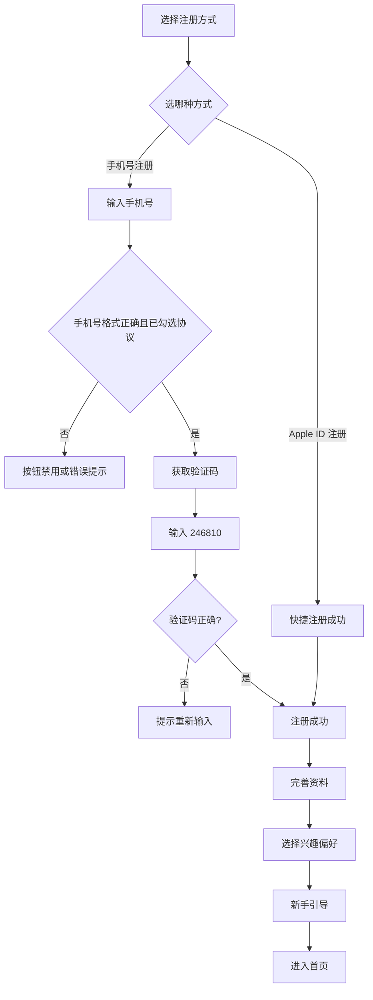

这里要注意：

- 手机号流程是“完整演示链路”
- Apple ID 是“快速演示链路”

所以比赛演示时，建议两条都知道，但主讲时优先走手机号链路，因为更完整。

### 20.3 资料与兴趣设置流程

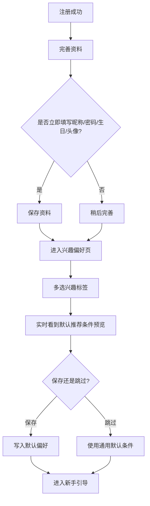

这条流程在现在这个版本里已经比较像真正可用的产品逻辑了，因为兴趣不是装饰，而是会转译成：

- 默认预算
- 默认距离
- 快出餐偏好
- 少油轻食偏好
- 是否避开重辣
- 是否优先粉面

### 20.4 首页推荐流程补充版

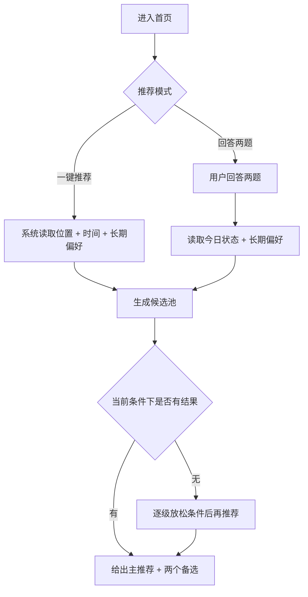

这个“逐级放松条件”很关键，因为它决定了产品不会轻易出现：

- 查无结果
- 用户卡死
- 用户必须重新选很多筛选项

### 20.5 推荐被否定后的回流流程

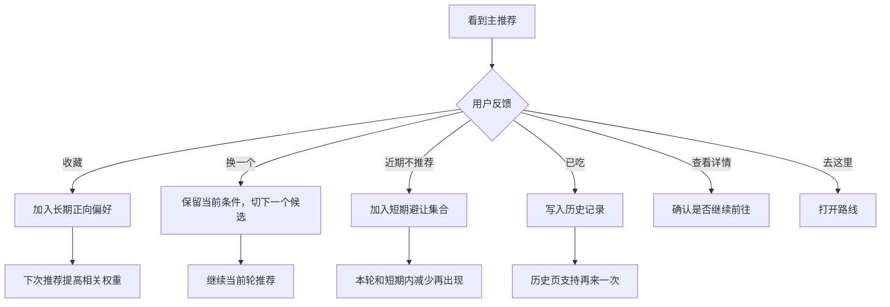

这是 2.0 比旧版明显成熟的地方。

旧版更像“随机抽一下”，新版已经开始形成反馈闭环。

### 20.6 定位失败降级流程

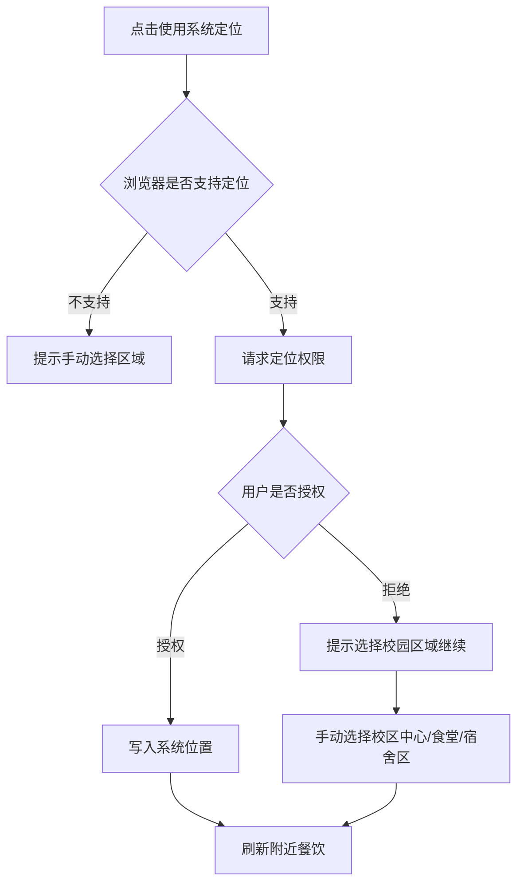

这个流程是比赛答辩很值得讲的一点，因为它正好对应 1.0 的主要问题修复：

- 1.0：定位失败容易阻断
- 2.0：定位失败也能继续完成核心任务

### 20.7 我的页面回流流程

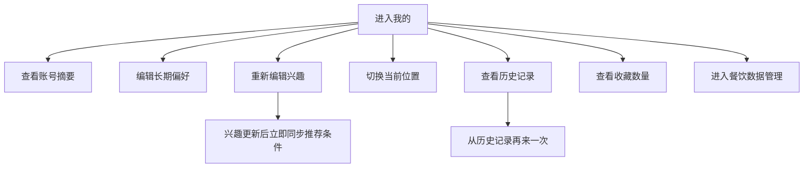

现在“我的”页已经不只是一个展示页，而是推荐系统的回流中心。

### 20.8 餐饮数据维护流程

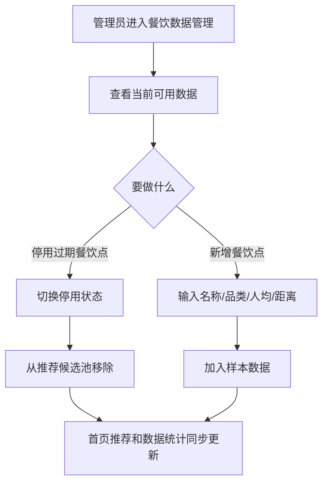

这条流程对比赛的意义不是“后台做得多完整”，而是说明你们已经考虑了：

- 数据不是写死一次就完
- 数据维护会影响推荐质量
- 周边商家变化时产品如何持续更新

---

## 21. 建议你接下来重点看的 4 条链路

如果你要自己在 CLI 里继续验证，优先看这 4 条：

1. 手机号注册 -> 验证码 -> 兴趣偏好 -> 首页
2. 我的 -> 兴趣 -> 修改后回首页
3. 首页推荐 -> 近期不推荐 -> 再次翻牌
4. 定位拒绝 -> 手动选区域 -> 继续推荐

这四条最能体现 2.0 是否已经从“页面原型”升级到“有产品闭环的原型”。
%% Error: Cannot create a waypoint in a note that's not the folder note. For more information, check the instructions [here](https://github.com/IdreesInc/Waypoint) %%